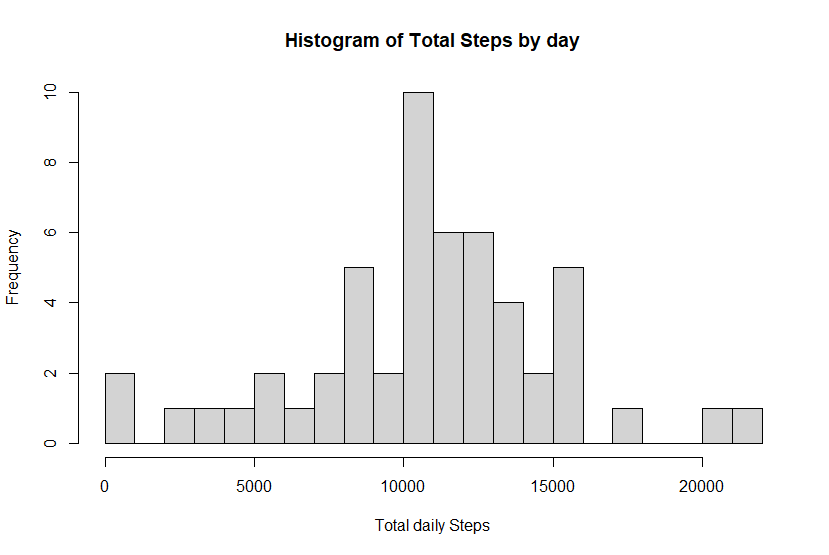
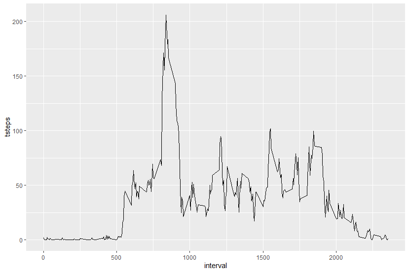
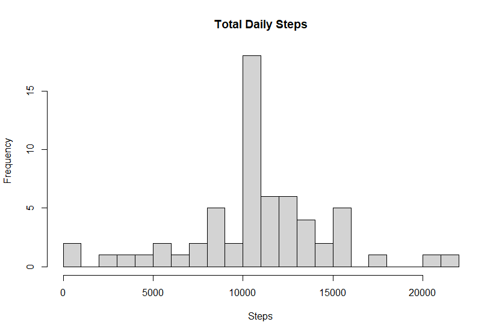
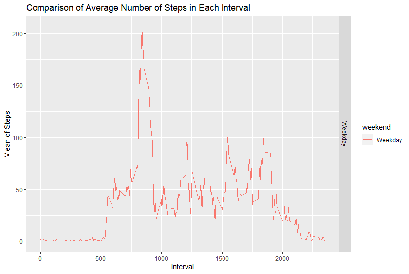

# Reproducible Research: 

## Loading and preprocessing the data

```r

fileurl <- "https://d396qusza40orc.cloudfront.net/repdata%2Fdata%2Factivity.zip"
zipfile <- "../Reproducible Research/data.zip"

filedir <- "../Reproducible Research"
unzip_path <- "../Reproducible Research/data"

if (!file.exists(filedir)){
  dir.create(filedir)
}
download.file(fileurl, file.path(zipfile))
unzip(zipfile, exdir = unzip_path)
datafile <- file.path(unzip_path, "activity.csv")


stepdata <- read.csv(datafile, header = TRUE)

```


## What is mean total number of steps taken per day?

```r
databydate <- stepdata %>% select(date, steps) %>% group_by(date) %>% summarise(tsteps = sum(steps)) %>% na.omit()
hist(databydate$tsteps, xlab = "Total daily Steps", main = "Histogram of Total Steps by day", breaks = 20)
```

 

```r
mean(databydate$tsteps)
median(databydate$tsteps)
```


## What is the average daily activity pattern?
```r

databyinterval <- stepdata %>% select(interval, steps) %>% na.omit() %>% group_by(interval) %>% summarise(tsteps=mean(steps))
ggplot(databyinterval, aes(x=interval, y=tsteps)) + geom_line()
```
 


```r
databyinterval[which(databyinterval$tsteps==max(databyinterval$tsteps)), ]
```


## Imputing missing values

```r
missingVals <- sum(is.na(data))
```


## Replace each missing value with the mean value of its 5-minute interval

```r
replacewithmean <- function(x) replace(x, is.na(x), mean(x, na.rm=TRUE))
meandata <- stepdata %>% group_by(interval) %>% mutate(steps= replacewithmean(steps))
head(meandata)
```

```r
FullSummedDataByDay <- aggregate(meandata$steps, by = list(meandata$date), sum)

names(FullSummedDataByDay)[1] = "date"
names(FullSummedDataByDay)[2] = "totalsteps"
```

```r
hist(FullSummedDataByDay$totalsteps, xlab = "Steps", ylab = "Frequency", main = "Total Daily Steps", breaks = 20)
```

 

## Are there differences in activity patterns between weekdays and weekends?

```r
oldmean <- mean(databydate$tsteps, na.rm = TRUE)
newmean <- mean(FullSummedDataByDay$totalsteps)
oldmedian <- median(databydate$tsteps, na.rm = TRUE)
newmedian <- median(FullSummedDataByDay$totalsteps)

meandata$date <- as.Date(meandata$date)
meandata$weekday <- weekdays(meandata$date)
meandata$weekend <- ifelse(meandata$weekday=="Saturday" | meandata$weekday=="Sunday", "Weekend", "Weekday")

meandataweekendweekday <- aggregate(meandata$steps, by = list(meandata$weekend, meandata$interval), na.omit(mean))
names(meandataweekendweekday) <- c("weekend", "interval", "steps")  
```

```r
ggplot(meandataweekendweekday, aes(x=interval, y=steps, color=weekend)) + geom_line()+ facet_grid(weekend ~.) + xlab("Interval") + ylab("Mean of Steps") + ggtitle("Comparison of Average Number of Steps in Each Interval")
```

 


